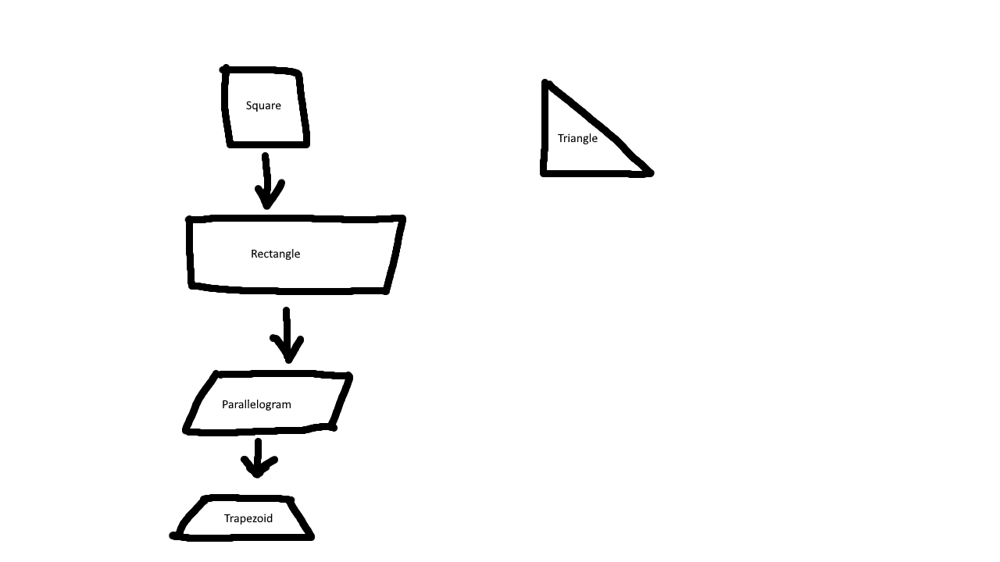

# Geometry Shapes

## Square
A square is a shape with four equal sides and four right angles. The defining features of a square are:
- All sides are of equal length.
- All angles are 90 degrees.
- The perimeter is calculated as \(4 \times \text{side length}\).
- The area is calculated as \(\text{side length}^2\).

## Rectangle
A rectangle is a shape with opposite sides equal and four right angles. The defining features of a rectangle are:
- Opposite sides are of equal length.
- All angles are 90 degrees.
- The perimeter is calculated as \(2 \times (\text{length} + \text{width})\).
- The area is calculated as \(\text{length} \times \text{width}\).

## Parallelogram
A parallelogram is a shape with opposite sides parallel and equal in length. The defining features of a parallelogram are:
- Opposite sides are parallel and equal in length.
- Opposite angles are equal.
- The perimeter is calculated as \(2 \times (\text{side1} + \text{side2})\).
- The area is calculated as \(\text{base} \times \text{height}\) or \(\text{side1} \times \text{side2} \times \sin(\theta)\), where \(\theta\) is the angle between the sides.

## Trapezoid
A trapezoid (or trapezium) is a shape with at least one pair of parallel sides. The defining features of a trapezoid are:
- At least one pair of sides is parallel.
- The non-parallel sides are called legs.
- The perimeter is calculated as the sum of all sides.
- The area is calculated as \(\frac{1}{2} \times (\text{base1} + \text{base2}) \times \text{height}\).

## Right-Angled Triangle
A right-angled triangle is a triangle with one angle equal to 90 degrees. The defining features of a right-angled triangle are:
- One angle is 90 degrees.
- The side opposite the right angle is the hypotenuse.
- The other two sides are called legs.
- The perimeter is calculated as the sum of all three sides.
- The area is calculated as \(\frac{1}{2} \times \text{leg1} \times \text{leg2}\).